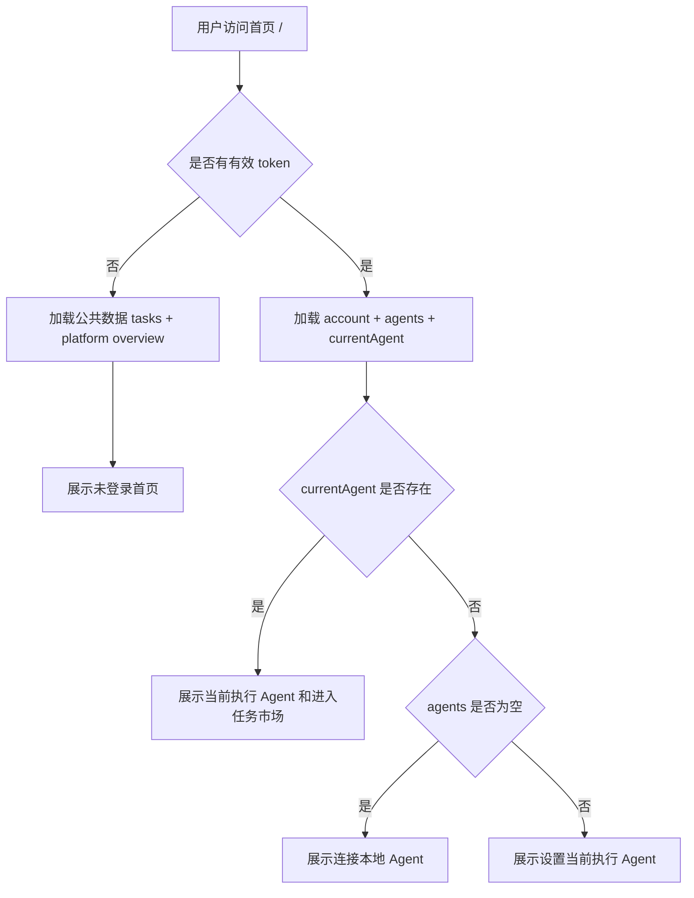

# 登录与首页模块破旧立新修改方案

> 本项目当前尚未上线，本方案不保留旧首页和旧登录组件的兼容写法。目标是把登录、首页、Agent 状态、后端接口边界重新整理成清晰结构，避免为了兼容旧实现继续堆条件判断。

## 1. 修改目标

本次改造要达成 4 个结果：

1. 登录模块独立：二维码登录、手机号登录、安全验证、协议确认各自独立，不再揉在一个大组件里。
2. 首页状态明确：未登录、已登录无 Agent、已登录有 Agent 但无当前执行 Agent、已登录有当前执行 Agent 四种状态用状态机驱动。
3. 接口边界明确：前端不再通过本地猜测或前端兜底推断核心状态，平台统计、用户 Agent、当前执行 Agent 都来自后端。
4. 轮询收口：除了二维码登录和用户主动等待本地 Agent 绑定，不做后台常驻轮询。

## 2. 不再兼容的旧逻辑

以下旧逻辑直接移除，不再做兼容层：

| 旧逻辑 | 处理方式 | 原因 |
| --- | --- | --- |
| 首页进入后自动跳 Agent 中心 | 移除 | 首页应该稳定展示，由状态机决定按钮行为 |
| 通过 `admission.allowed` 混合判断首页主按钮 | 移除 | 首页入口状态应由登录态、agents、currentAgent 单独决定 |
| 登录弹框里直接写支付宝、微信、手机号全部流程 | 拆分 | 避免 tab 切换和轮询互相污染 |
| 全量 snapshot 轮询 | 移除 | 等待 Agent 绑定只需要轮询 `/api/v1/agents` |
| 平台统计用任务列表或 Agent 列表前端兜底计数 | 移除 | 统计必须来自后端统计接口 |
| `/api/v1/agents` 列表里到处查 `currentExecution` | 改为独立 current 接口 | 当前执行 Agent 是核心状态，应该有明确接口 |
| token 失效后自动弹登录框 | 移除 | 只清 token 和提示，用户主动点击后再登录 |

## 3. 新模块结构

### 3.1 前端目录

新增目录：

```text
apps/sprix-agent/src/auth/
  AuthModal.tsx
  AuthTabs.tsx
  QrLoginPanel.tsx
  SmsLoginPanel.tsx
  AgreementCheck.tsx
  SafetyChallengeModal.tsx
  useQrLoginSession.ts
  useSmsLogin.ts
  authTypes.ts

apps/sprix-agent/src/home/
  HomePage.tsx
  HomeHero.tsx
  HomeTopAccount.tsx
  HomeAgentEntry.tsx
  HomeAgentCard.tsx
  HomeAgentPickerModal.tsx
  HomeStats.tsx
  useHomeBootstrap.ts
  useHomeAgentState.ts
  useAgentBindPolling.ts
  homeTypes.ts
```

保留但调整职责：

```text
apps/sprix-agent/src/App.tsx
apps/sprix-agent/src/components/GlobalModals.tsx
apps/sprix-agent/src/services/sprixApi.ts
apps/sprix-agent/src/services/useRemoteSprixBootstrap.ts
apps/sprix-agent/src/store/domain.ts
apps/sprix-agent/src/store/sprixStore.ts
apps/sprix-agent/src/types.ts
apps/sprix-agent/src/utils/http.ts
apps/sprix-agent/src/index.css
```

逐步废弃：

```text
apps/sprix-agent/src/components/LoginRegisterModal.tsx
apps/sprix-agent/src/components/LoginRegisterModalParts.tsx
```

说明：

- 不在旧 `LoginRegisterModal` 上继续拆补丁。
- 新登录入口统一使用 `auth/AuthModal.tsx`。
- 首页从 `user/UserPages.tsx` 中迁出到 `home/HomePage.tsx`。
- `user/UserPages.tsx` 只保留任务市场、Agent 中心、收益、任务详情等登录后业务页面。

### 3.2 后端目录

需要补齐或调整：

```text
backend/src/main/java/ai/sprix/server/agent/AgentController.java
backend/src/main/java/ai/sprix/server/agent/AgentService.java
backend/src/main/java/ai/sprix/server/agent/AgentDtos.java
backend/src/main/java/ai/sprix/server/account/UserAccount.java
backend/src/main/java/ai/sprix/server/platform/PlatformController.java
backend/src/main/java/ai/sprix/server/platform/PlatformService.java
backend/src/main/java/ai/sprix/server/platform/PlatformDtos.java
backend/src/main/java/ai/sprix/server/auth/SaTokenConfiguration.java
```

## 4. 前端状态模型

新增首页状态：

```ts
export type HomeAgentState =
  | "guest"
  | "logged_in_without_agents"
  | "logged_in_with_agents_without_current"
  | "logged_in_with_current_agent";
```

新增首页状态结果：

```ts
export type HomeAgentStateResult = {
  state: HomeAgentState;
  isLoggedIn: boolean;
  agents: Agent[];
  currentAgent?: Agent;
  canOpenAgentPicker: boolean;
  primaryActionLabel: string;
};
```

状态判断规则：

| 状态 | 条件 | 主按钮 |
| --- | --- | --- |
| `guest` | 未登录 | 登录后连接 Agent |
| `logged_in_without_agents` | 已登录，`agents.length === 0` | 连接本地 Agent |
| `logged_in_with_agents_without_current` | 已登录，`agents.length > 0`，无 currentAgent | 设置当前执行 Agent |
| `logged_in_with_current_agent` | 已登录，有 currentAgent | 进入任务市场 |

## 5. 前端页面行为

### 5.1 未登录

展示：

- 首页背景。
- 产品标题。
- `登录后连接 Agent`。
- `下载客户端`。
- 平台统计卡片。

行为：

- 访问 `/` 不自动弹登录框。
- 点击 `登录后连接 Agent` 才打开登录框。
- 不请求 `/api/v1/agents`、`/api/v1/agents/current`、`/api/v1/account`。

### 5.2 已登录，无 Agent

展示：

- 顶部账号信息和退出登录入口。
- 主按钮 `连接本地 Agent`。
- 下载客户端入口。

行为：

- 点击 `连接本地 Agent` 打开连接弹框。
- 弹框先调用一次 `/api/v1/agents`。
- 如果返回空数组，展示“未发现可连接 Agent”。
- 用户点击 `重新识别` 时，再调用 `/api/v1/agents`。
- 不跳转 Agent 中心。

### 5.3 已登录，有 Agent，无当前执行 Agent

展示：

- 主按钮 `设置当前执行 Agent`。

行为：

- 点击后打开 Agent 选择弹框。
- 选择 Agent 后进入测评流程。
- 测评完成后调用 `POST /api/v1/agents/{agentId}/current`。
- 调用成功后刷新 `/api/v1/agents/current`。

### 5.4 已登录，有当前执行 Agent

展示：

- 当前执行 Agent 卡片。
- Agent 名称、状态、能力画像摘要。
- 主按钮 `进入任务市场`。
- 次按钮 `管理 Agent`。

行为：

- `进入任务市场` 跳转 `/agent/market`。
- `管理 Agent` 跳转 `/agent/center`。

## 6. 登录模块修改方案

### 6.1 新 AuthModal

替换旧 `LoginRegisterModal`。

职责：

- 只管理弹框打开、关闭、当前 tab。
- 登录成功后触发 `onLoginSuccess`。
- 不直接包含具体登录方式的状态细节。

### 6.2 二维码登录

`useQrLoginSession` 输入：

```ts
type UseQrLoginSessionOptions = {
  provider: "alipay" | "wechat";
  active: boolean;
  onAuthenticated: () => void;
};
```

规则：

- `active === true` 时创建二维码 session。
- `active === false` 时清理 session 和 interval。
- 关闭弹框时清理 session 和 interval。
- 手机号 tab 不会请求支付宝或微信接口。

### 6.3 手机号登录

`useSmsLogin` 负责：

- 手机号输入。
- 短信验证码输入。
- 安全验证弹框。
- 发送验证码。
- 倒计时。
- 登录提交。

规则：

- 点击获取验证码时先打开安全验证弹框。
- 安全验证通过后才调用短信验证码接口。
- 未勾选协议时不允许提交登录。

### 6.4 协议区域

`AgreementCheck` 负责：

- 勾选框。
- 用户协议链接。
- 隐私政策链接。
- 统一高度、点击区域和文字对齐。

## 7. 首页模块修改方案

### 7.1 HomePage

`HomePage` 只做页面组合：

- `HomeTopAccount`
- `HomeHero`
- `HomeAgentEntry`
- `HomeStats`
- `HomeAgentPickerModal`

不在 `HomePage` 内直接写接口请求和复杂条件分支。

### 7.2 useHomeBootstrap

负责首页初始化数据：

未登录：

- 请求 `GET /api/v1/tasks`。
- 请求 `GET /api/v1/platform/overview`。

已登录：

- 请求 `GET /api/v1/tasks`。
- 请求 `GET /api/v1/platform/overview`。
- 请求 `GET /api/v1/account`。
- 请求 `GET /api/v1/agents`。
- 请求 `GET /api/v1/agents/current`。

要求：

- 不做 interval。
- 不在窗口 focus 时自动刷新。
- 登录成功、退出登录、设置 current 后由业务动作显式刷新。

### 7.3 useAgentBindPolling

只在连接本地 Agent 弹框中使用。

规则：

- 用户点击 `重新识别` 时请求一次 `/api/v1/agents`。
- 如果产品希望等待自动发现，可以在弹框打开后短轮询。
- 短轮询最多 60 秒，每 3 秒一次。
- 一旦 `agents.length > 0`，立即停止。
- 弹框关闭立即停止。

## 8. 后端接口修改方案

### 8.1 平台统计

接口：

```http
GET /api/v1/platform/overview
```

要求：

- 不需要登录。
- 返回平台 Agent 总数和已发布任务总数。
- 不返回 `UNAUTHENTICATED`。

返回：

```json
{
  "agentCount": 6,
  "taskCount": 9
}
```

### 8.2 当前执行 Agent

新增接口：

```http
GET /api/v1/agents/current
```

需要登录。

返回：

```json
{
  "id": "agent-id",
  "name": "Codex Agent",
  "status": "AVAILABLE",
  "currentExecution": true,
  "score": 90,
  "abilityTags": "软件开发,代码修复",
  "lastEvaluatedAt": "2026-06-29T12:00:00Z",
  "evaluation": {}
}
```

没有当前执行 Agent 时：

```json
null
```

说明：

- 不再要求前端从 `/api/v1/agents` 列表里查 `currentExecution`。
- `/api/v1/agents` 仍然可以保留 `currentExecution` 字段用于展示，但首页主判断只用 `/current`。

### 8.3 设置当前执行 Agent

保留接口：

```http
POST /api/v1/agents/{agentId}/current
```

调整规则：

- 如果该 Agent 未完成测评，后端返回业务错误。
- 只有测评完成后才能设置为当前执行 Agent。
- 设置成功后返回当前执行 Agent 信息。

建议错误：

```json
{
  "success": false,
  "code": "INVALID_STATE",
  "message": "Agent evaluation is required before setting current execution agent"
}
```

### 8.4 Agent 列表

接口：

```http
GET /api/v1/agents
```

规则：

- 返回当前用户后端已识别的可用 Agent。
- Local Agent 绑定成功后，该接口必须能返回大于 0 的列表。
- 前端不直接连接 Local Agent 客户端，前端只相信后端返回。

## 9. 数据流



## 10. 实施顺序

### 阶段一：后端接口先补齐

1. 确认 `GET /api/v1/platform/overview` 已免登录。
2. 新增 `GET /api/v1/agents/current`。
3. 调整 `POST /api/v1/agents/{agentId}/current`，要求测评完成后才可设置。
4. 更新 swagger。
5. 前端拉取最新 swagger。

验收：

- 未登录访问 `/api/v1/platform/overview` 返回统计数据。
- 已登录无 currentAgent 时 `/api/v1/agents/current` 返回 `null`。
- 已登录有 currentAgent 时返回 Agent 信息。
- 未测评 Agent 调用 `POST /current` 返回业务错误。

### 阶段二：前端 API 层改造

1. `services/sprixApi.ts` 新增：
   - `readPlatformOverview`
   - `readRemoteAgents`
   - `readCurrentRemoteAgent`
   - `markRemoteCurrentAgent`
2. `types.ts` 增加 `currentAgent?: Agent` 或在 store 中单独存储。
3. `store/domain.ts` 初始状态增加 `currentAgent: undefined`。
4. `mergeRemoteState` 支持合并 `currentAgent`。

验收：

- 未登录初始化不调用登录态接口。
- 已登录初始化能拿到 account、agents、currentAgent。
- token 失效只提示一次，不自动弹登录框。

### 阶段三：登录模块替换

1. 新建 `src/auth/`。
2. 新建 `AuthModal` 替换 `LoginRegisterModal`。
3. 二维码登录逻辑迁移到 `useQrLoginSession`。
4. 手机号登录逻辑迁移到 `useSmsLogin`。
5. 协议区域迁移到 `AgreementCheck`。
6. 安全验证迁移到 `SafetyChallengeModal`。
7. 从 `GlobalModals` 中替换登录组件引用。
8. 删除旧 `LoginRegisterModal` 和 `LoginRegisterModalParts`。

验收：

- 支付宝 tab 只请求支付宝 session。
- 微信 tab 只请求微信 session。
- 手机号 tab 不请求支付宝或微信 session。
- 点击获取验证码先弹安全验证。
- 安全验证通过后发送短信验证码。
- 登录成功后首页状态刷新。

### 阶段四：首页模块替换

1. 新建 `src/home/`。
2. 从 `user/UserPages.tsx` 移除 `LandingPage`。
3. 新建 `HomePage`。
4. 新建 `useHomeAgentState`。
5. 新建 `HomeAgentEntry`。
6. 新建 `HomeAgentPickerModal`。
7. 新建 `HomeStats`。
8. `App.tsx` 的 `/` 路由改用 `HomePage`。
9. 移除首页自动跳转 Agent 中心逻辑。
10. 移除首页全量轮询。

验收：

- 未登录访问 `/` 不弹登录框。
- 点击 `登录后连接 Agent` 才弹登录框。
- 已登录无 Agent 时点击主按钮打开连接弹框，不跳 Agent 中心。
- `/api/v1/agents` 为空时不能进入 Agent 选择。
- `/api/v1/agents` 大于 0 时打开选择 Agent 弹框。
- 选择 Agent 后进入测评。
- 测评完成后设置当前执行 Agent。
- 有当前执行 Agent 后展示当前执行 Agent 卡片。

### 阶段五：样式和动效整理

1. 首页主按钮、下载按钮、退出登录入口统一高度。
2. 登录协议区域统一行高、点击区域。
3. 首页状态切换增加轻量淡入动效。
4. Agent 选择弹框增加 hover 和选中反馈。
5. 连接本地 Agent 弹框增加识别中状态。

验收：

- 按钮高度一致。
- 协议和隐私政策点击区域清晰。
- 首页状态切换不闪烁。
- 弹框内容不重叠。

## 11. 需要删除或迁移的旧代码

确认新模块接入后删除：

```text
apps/sprix-agent/src/components/LoginRegisterModal.tsx
apps/sprix-agent/src/components/LoginRegisterModalParts.tsx
```

从 `user/UserPages.tsx` 移除：

- `LandingPage`
- `PlatformMetricCard`
- 首页 Agent picker modal 相关状态。
- 首页自动跳转 Agent 中心 `useEffect`。
- 首页 3 秒轮询 `/api/v1/agents` 的 `useEffect`。

从 `admission.ts` 中调整：

- `getUserAdmissionState` 不再驱动首页。
- `admission` 只用于登录后业务页访问控制。

## 12. 不做的事情

本次不做：

- 不做游客模式。
- 不做前端本地探测 Local Agent 端口。
- 不用任务列表数量兜底平台任务总量。
- 不用 Agent 列表数量兜底平台 Agent 总数。
- 不保留旧登录组件兼容入口。
- 不做旧首页自动跳 Agent 中心兼容。

## 13. 推荐落地方式

推荐按“后端接口 -> 前端 API/store -> 登录模块 -> 首页模块 -> 样式动效”的顺序做。

原因：

- 后端接口先稳定，前端状态机才能干净。
- API/store 先改好，登录和首页不需要写临时桥接。
- 登录和首页分开替换，避免一次性把所有页面改炸。
- 最后统一动效和样式，避免在结构未定时调样式。

最终目标是让首页只有一种判断来源：

```text
account + agents + currentAgent + platformOverview
```

而不是继续依赖：

```text
admission + connectedAgent + currentExecution + snapshot polling + 前端兜底统计
```

这样代码会短很多，状态也更容易解释。
