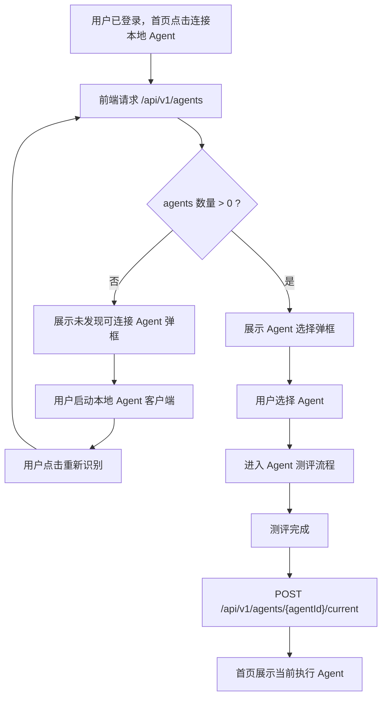
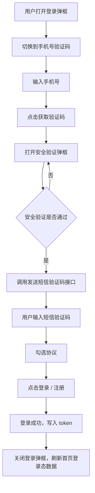
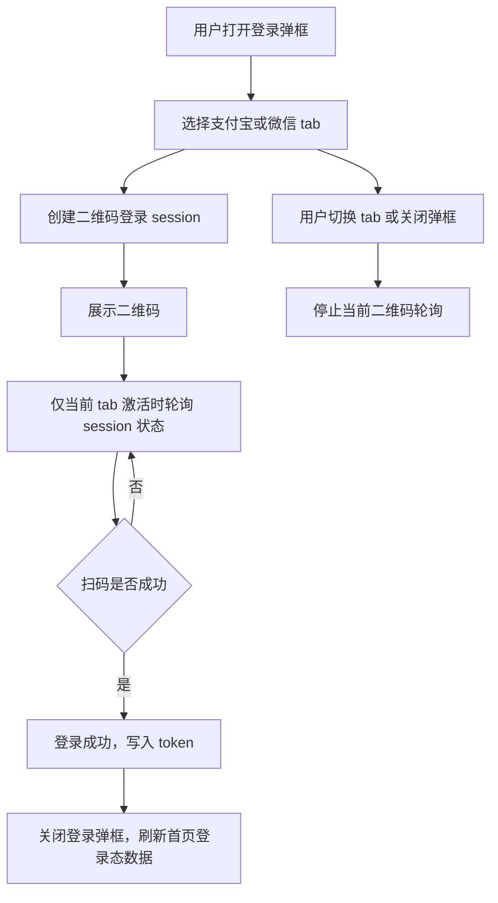

# 登录与首页模块重设计方案

## 1. 背景

当前登录和首页模块已经同时承载了登录注册、二维码轮询、短信验证码、安全验证、协议确认、首页 Agent 入口、平台统计、任务市场跳转、本地 Agent 连接识别等逻辑。

随着需求从“登录后直接进入平台”变成“围绕当前执行 Agent 建立首页入口”，现有实现继续打补丁会导致状态判断分散、接口轮询重复、登录失效提示频繁、首页按钮行为不稳定。

本方案目标是重新梳理登录模块和首页模块边界，让前端交互、后端接口、Local Agent 绑定流程形成明确闭环。

## 2. 当前主要问题

### 2.1 登录模块职责过重

`LoginRegisterModal` 同时处理：

- 支付宝二维码登录会话创建和轮询。
- 微信二维码登录会话创建和轮询。
- 手机号验证码登录。
- 手机验证码前置安全验证。
- 用户协议和隐私政策展示。
- 登录成功后的 token 写入和全局状态刷新。

这些逻辑放在一个组件里，会导致 tab 切换、弹框关闭、登录过期、轮询清理等行为互相影响。

### 2.2 二维码登录轮询边界不清

之前出现过切换到手机号验证码 tab 后，仍然请求支付宝登录会话状态接口的问题。

正确行为应该是：

- 只有当前 tab 激活时，才允许对应二维码登录方式轮询。
- 切换 tab 后，旧 tab 的轮询必须停止。
- 关闭登录弹框后，所有登录轮询必须停止。

### 2.3 首页状态判断不明确

首页目前同时要处理：

- 未登录。
- 已登录，但没有可用 Agent。
- 已登录，有可用 Agent，但没有当前执行 Agent。
- 已登录，有当前执行 Agent。
- 本地 Agent 客户端是否已启动。
- 后端是否已经完成 Local Agent 绑定。

如果没有统一状态机，按钮文案、跳转目标、弹框行为会越来越难维护。

### 2.4 接口轮询范围过大

首页不应该因为等待本地 Agent 绑定，就不断刷新任务列表、平台统计、账户信息等无关接口。

正确策略应该是：

- 公共数据：首页加载时请求一次。
- 登录态数据：登录成功、退出登录、页面初始化时请求一次。
- 等待 Agent 绑定：只短时间轮询 `/api/v1/agents`。
- 二维码登录：只轮询当前激活登录方式对应的 session。

### 2.5 登录失效提示容易堆叠

如果多个接口同时返回未登录或 token 失效，页面不应该连续弹出大量提示。

正确行为应该是：

- 清除本地 token。
- 展示一次中文提示，例如“登录已过期，请重新登录”。
- 不自动打开登录弹框。
- 等用户主动点击登录入口时，再打开登录弹框。

## 3. 产品状态定义

首页围绕“当前执行 Agent”展开，不直接以“是否连接本机 Agent”作为唯一入口判断。

### 3.1 未登录

页面展示首页背景和产品主视觉。

主按钮：

- 文案：`登录后连接 Agent`
- 行为：点击后打开登录弹框。

辅助按钮：

- 文案：`下载客户端`
- 行为：跳转或下载 Local Agent 客户端。

要求：

- 未登录访问 `/` 不自动弹登录弹框。
- 未登录状态下不请求需要登录的接口，避免无意义的登录失效提示。

### 3.2 已登录，无可用 Agent

判断依据：

- `/api/v1/agents` 返回数量为 0。

主按钮：

- 文案：`连接本地 Agent`
- 行为：打开连接本地 Agent 弹框。

连接弹框展示：

- 未发现可连接 Agent。
- 提示用户先启动本地 Agent 客户端。
- 提供 `重新识别` 按钮。
- 提供 `下载客户端` 按钮。

要求：

- 不直接跳转 Agent 中心。
- 不假设已经连接成功。
- 只有 `/api/v1/agents` 返回数量大于 0，才允许进入 Agent 选择或设置流程。

### 3.3 已登录，有可用 Agent，但没有当前执行 Agent

判断依据：

- `/api/v1/agents` 返回数量大于 0。
- 当前执行 Agent 为空。

主按钮：

- 文案：`设置当前执行 Agent`
- 行为：打开 Agent 选择弹框。

Agent 选择弹框：

- 展示当前账号下可用 Agent 列表。
- 用户选择一个 Agent。
- 进入该 Agent 的测评流程。
- 首个测评完成后，前端调用 `POST /current` 设置当前执行 Agent。

要求：

- 不自动替用户选择 Agent。
- 不在没有测评完成前设置当前执行 Agent。

### 3.4 已登录，有当前执行 Agent

判断依据：

- 后端返回当前执行 Agent。

首页展示：

- 当前执行 Agent 卡片。
- Agent 名称。
- 当前 Agent 可执行任务说明。

主按钮：

- 文案：`进入任务市场` 或 `进入 Agent 中心`
- 行为：按产品最终定义跳转。

建议：

- 如果目标是接单赚钱，主按钮建议为 `进入任务市场`。
- 如果目标是管理、切换、查看画像，次按钮建议为 `管理 Agent`。

## 4. 前端模块设计

### 4.1 登录模块拆分

建议目录：

```text
apps/sprix-agent/src/components/login/
  LoginRegisterModal.tsx
  LoginTabs.tsx
  QrLoginPanel.tsx
  SmsLoginPanel.tsx
  AgreementCheck.tsx
  SafetyChallengeModal.tsx
  useQrLoginSession.ts
  useSmsLogin.ts
```

职责说明：

| 模块 | 职责 |
| --- | --- |
| `LoginRegisterModal` | 登录弹框壳层、打开关闭、tab 切换 |
| `LoginTabs` | 支付宝、微信、手机号 tab 展示 |
| `QrLoginPanel` | 二维码展示和状态提示 |
| `SmsLoginPanel` | 手机号、验证码、登录按钮 |
| `AgreementCheck` | 用户协议、隐私政策和勾选状态 |
| `SafetyChallengeModal` | 点击获取验证码后的安全验证弹框 |
| `useQrLoginSession` | 创建二维码 session、轮询、停止轮询 |
| `useSmsLogin` | 手机号登录表单、验证码发送、登录提交 |

关键规则：

- `useQrLoginSession` 必须接收 `active` 参数。
- `active === false` 时不创建 session、不轮询。
- 弹框关闭时统一停止所有轮询。
- 手机号 tab 不允许触发支付宝或微信轮询。
- 验证码必须先通过安全验证弹框后再发送。

### 4.2 首页模块拆分

建议目录：

```text
apps/sprix-agent/src/home/
  HomePage.tsx
  HomeHero.tsx
  HomeAgentEntry.tsx
  HomeAgentCard.tsx
  HomeAgentPickerModal.tsx
  HomeStats.tsx
  useHomeBootstrap.ts
  useHomeAgentState.ts
  useAgentBindPolling.ts
```

职责说明：

| 模块 | 职责 |
| --- | --- |
| `HomePage` | 首页页面组合 |
| `HomeHero` | 主标题、主按钮、下载客户端 |
| `HomeAgentEntry` | 根据首页状态决定按钮文案和行为 |
| `HomeAgentCard` | 当前执行 Agent 卡片 |
| `HomeAgentPickerModal` | 可用 Agent 选择弹框 |
| `HomeStats` | 平台 Agent 数量、平台任务总量 |
| `useHomeBootstrap` | 页面初始化数据加载 |
| `useHomeAgentState` | 首页 Agent 状态机 |
| `useAgentBindPolling` | 等待本地 Agent 绑定时短轮询 `/api/v1/agents` |

### 4.3 首页状态机

建议前端统一收敛为以下枚举：

```ts
type HomeAgentState =
  | "guest"
  | "logged_in_without_agents"
  | "logged_in_with_agents_without_current"
  | "logged_in_with_current_agent";
```

状态来源：

| 状态 | 判断条件 |
| --- | --- |
| `guest` | 本地无有效 token 或后端账户未登录 |
| `logged_in_without_agents` | 已登录，`agents.length === 0` |
| `logged_in_with_agents_without_current` | 已登录，`agents.length > 0`，但无 currentAgent |
| `logged_in_with_current_agent` | 已登录，存在 currentAgent |

按钮行为：

| 状态 | 主按钮 | 行为 |
| --- | --- | --- |
| `guest` | 登录后连接 Agent | 打开登录弹框 |
| `logged_in_without_agents` | 连接本地 Agent | 打开连接弹框，识别 `/api/v1/agents` |
| `logged_in_with_agents_without_current` | 设置当前执行 Agent | 打开 Agent 选择弹框 |
| `logged_in_with_current_agent` | 进入任务市场 | 跳转任务市场 |

## 5. 后端接口设计

### 5.1 平台统计接口

接口：

```http
GET /api/v1/platform/overview
```

是否需要登录：

- 不需要。

返回：

```json
{
  "agentCount": 6,
  "taskCount": 9
}
```

用途：

- 首页平台 Agent 数量。
- 首页平台任务总量。

要求：

- 该接口不能返回 `Please login first`。
- 如果后端数据暂不可用，应该返回 0 或明确业务错误，而不是触发登录态错误。

### 5.2 用户 Agent 列表

接口：

```http
GET /api/v1/agents
```

是否需要登录：

- 需要。

用途：

- 判断当前用户是否已有可用 Agent。
- 首页 `连接本地 Agent` 按钮是否能进入选择流程。
- Agent 选择弹框列表。

要求：

- 本地 Agent 绑定成功后，该接口应该能返回新绑定的 Agent。
- 前端以该接口返回数量作为是否有可用 Agent 的唯一依据。

### 5.3 当前执行 Agent

建议接口：

```http
GET /api/v1/agents/current
```

返回：

```json
{
  "id": "agent-id",
  "name": "Codex Agent",
  "status": "ONLINE",
  "profileStatus": "COMPLETED"
}
```

用途：

- 首页判断是否存在当前执行 Agent。
- 首页展示当前执行 Agent 卡片。
- 判断主按钮是否进入任务市场。

### 5.4 设置当前执行 Agent

接口：

```http
POST /api/v1/agents/{agentId}/current
```

调用时机：

- 用户选择 Agent 后，不立即调用。
- 该 Agent 首个测评完成后调用。

原因：

- 避免未完成能力画像的 Agent 被设置为当前执行 Agent。
- 保证进入任务市场的 Agent 具备可展示的能力画像。

### 5.5 Local Agent 绑定回跳

已有约定：

- 后端完成绑定后回跳首页 `/`。
- 前端不从回跳参数直接判断绑定成功。
- 前端回到首页后重新请求 `/api/v1/agents`。
- 只有 `/api/v1/agents` 返回数量大于 0，才认为绑定成功。

## 6. Local Agent 连接流程



## 7. 登录流程

### 7.1 手机号验证码登录



### 7.2 支付宝 / 微信扫码登录



## 8. 登录失效处理

统一规则：

- 任意需要登录的接口返回 `UNAUTHENTICATED` 或 HTTP 401 时，前端清除 token。
- 只展示一次提示：`登录已过期，请重新登录`。
- 不自动打开登录弹框。
- 不连续弹出多条英文 `Please login first`。
- 用户再次点击登录入口时，才打开登录弹框。

接口例外：

- 公共接口、可选接口、首页统计接口如果失败，不应该触发全局登录弹框。
- 这类接口需要通过请求配置标记为静默处理。

## 9. 数据刷新策略

### 9.1 页面初始化

首页初始化请求：

- `GET /api/v1/tasks`
- `GET /api/v1/platform/overview`
- 如果存在 token，再请求：
  - `GET /api/v1/account`
  - `GET /api/v1/agents`
  - `GET /api/v1/agents/current`

### 9.2 登录成功后

登录成功后请求：

- `GET /api/v1/account`
- `GET /api/v1/agents`
- `GET /api/v1/agents/current`

### 9.3 退出登录后

退出登录后：

- 清除 token。
- 清除账号信息。
- 清除用户 Agent 信息。
- 首页回到未登录态。
- 不自动打开登录弹框。

### 9.4 等待本地 Agent 绑定

只有用户主动点击 `重新识别` 或进入连接弹框等待状态时，才允许请求：

- `GET /api/v1/agents`

可选短轮询规则：

- 间隔：3 秒。
- 最大时长：60 秒。
- 成功条件：`agents.length > 0`。
- 成功后立即停止轮询。
- 用户关闭弹框后立即停止轮询。

## 10. 前端改造步骤

### 第一阶段：止血

目标：

- 停止无关接口重复轮询。
- 修复登录失效提示堆叠。
- 修复 inactive tab 仍然轮询二维码 session。

改动：

- `useRemoteSprixBootstrap` 不再做全量轮询。
- 登录二维码轮询加 active tab 判断。
- 401 / UNAUTHENTICATED 统一清 token 和单次提示。

### 第二阶段：登录模块拆分

目标：

- 降低 `LoginRegisterModal` 复杂度。
- 独立管理短信登录、二维码登录、安全验证、协议。

改动：

- 新增 `components/login/` 目录。
- 抽出 `useQrLoginSession`。
- 抽出 `useSmsLogin`。
- 抽出 `AgreementCheck`。
- 抽出 `SafetyChallengeModal`。

### 第三阶段：首页模块拆分

目标：

- 首页只根据明确状态机渲染。
- 首页主按钮行为稳定。
- Agent 选择、连接弹框、统计卡片解耦。

改动：

- 新增 `home/` 目录。
- 抽出 `HomeAgentEntry`。
- 抽出 `HomeAgentPickerModal`。
- 抽出 `HomeStats`。
- 新增 `useHomeAgentState`。
- 新增 `useAgentBindPolling`。

### 第四阶段：后端接口补齐

目标：

- 前端不做数据猜测。
- 首页统计、当前执行 Agent、Agent 绑定状态都有明确后端来源。

后端需要确认或新增：

- `GET /api/v1/platform/overview`
- `GET /api/v1/agents`
- `GET /api/v1/agents/current`
- `POST /api/v1/agents/{agentId}/current`

## 11. 验收标准

### 登录模块

- 未登录访问首页不会自动弹登录弹框。
- 点击登录按钮才打开登录弹框。
- 手机号验证码 tab 不会请求支付宝或微信登录 session。
- 点击获取验证码后先打开安全验证弹框。
- 安全验证通过后才发送短信验证码。
- 登录过期只提示一次中文文案，不堆叠英文提示。
- 关闭登录弹框后不再有二维码轮询请求。

### 首页模块

- 未登录时展示首页背景和登录入口。
- 已登录但无 Agent 时，点击连接本地 Agent 展示连接弹框，不跳 Agent 中心。
- `/api/v1/agents` 返回数量为 0 时，不允许进入 Agent 选择流程。
- `/api/v1/agents` 返回数量大于 0 时，允许选择 Agent。
- 选择 Agent 后进入测评流程。
- 首个测评完成后调用 `POST /current`。
- 有当前执行 Agent 后，首页展示当前执行 Agent 卡片。
- 平台 Agent 数量和任务总量来自后端统计接口，不做前端兜底计数。

## 12. 风险和注意事项

- 如果线上后端没有开放 `GET /api/v1/platform/overview`，首页统计仍会显示 `-`。
- 如果后端没有当前执行 Agent 接口，前端只能临时从 Agent 列表字段推断，不建议长期这样做。
- 如果 Local Agent 绑定成功后 `/api/v1/agents` 不更新，前端不能判断连接成功，需要后端和客户端联调。
- 如果产品最终决定“有当前执行 Agent 后首页自动跳 Agent 中心”，需要单独确认；当前建议是首页稳定展示，由用户点击进入。

## 13. 推荐结论

本模块建议按“状态机 + 明确接口来源 + 限定轮询范围”重做。

前端不要通过本地探测、任务列表数量或临时兜底去猜 Agent 状态。所有核心状态都应该来自后端：

- 平台统计来自 `GET /api/v1/platform/overview`。
- 用户 Agent 来自 `GET /api/v1/agents`。
- 当前执行 Agent 来自 `GET /api/v1/agents/current`。
- 当前执行 Agent 设置来自 `POST /api/v1/agents/{agentId}/current`。

这样首页、登录、Local Agent 绑定、Agent 测评、任务市场入口才能稳定串起来。
